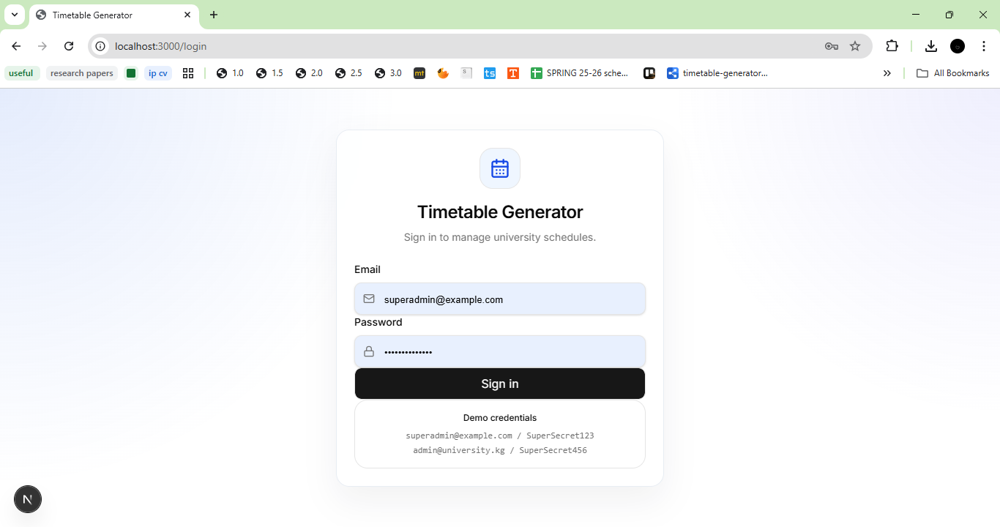
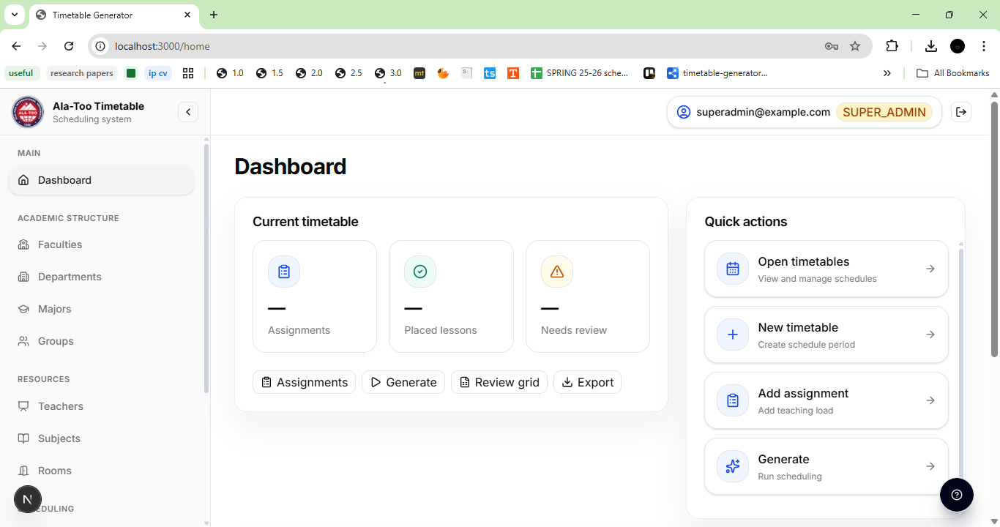
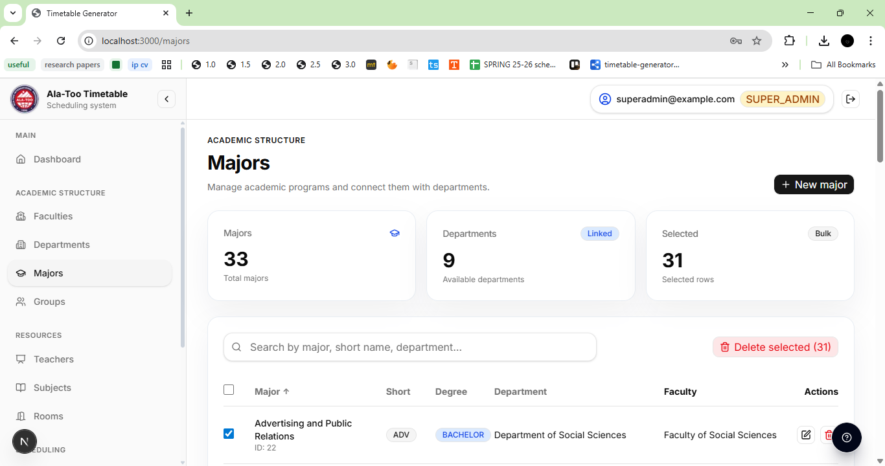
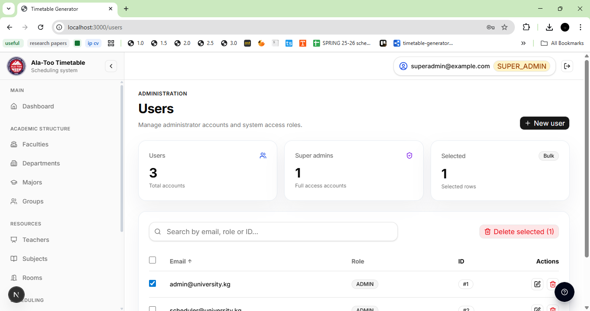
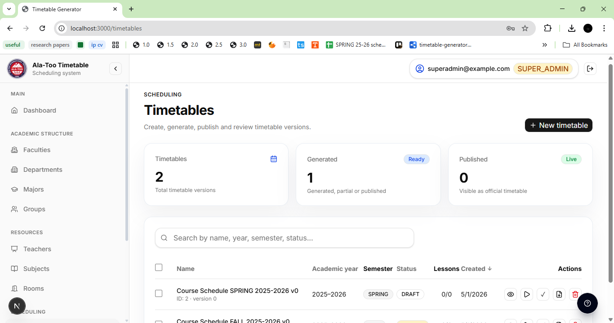
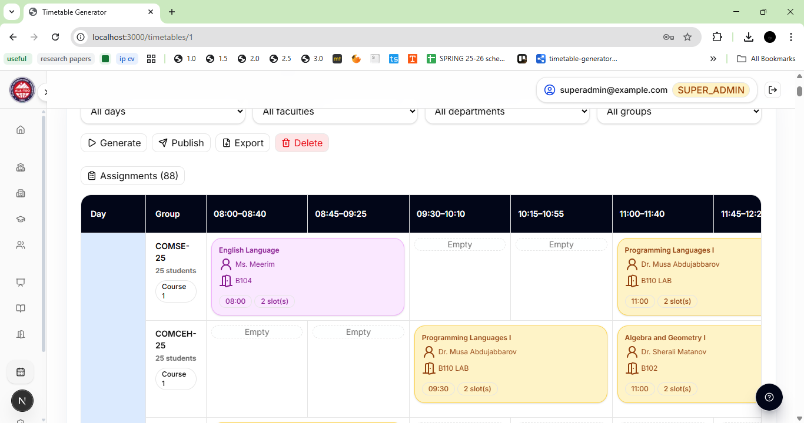
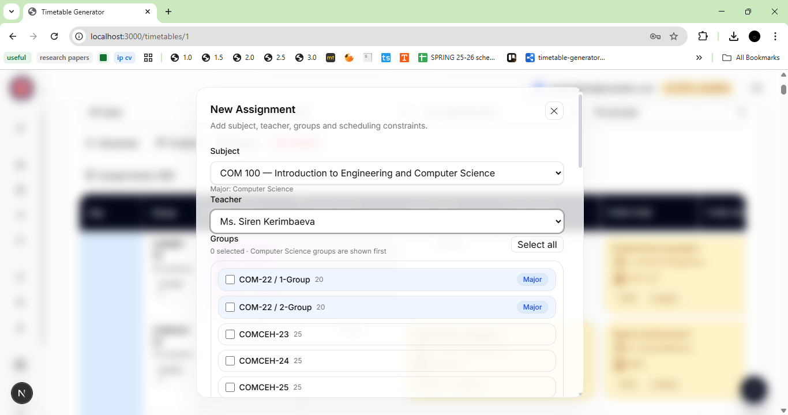
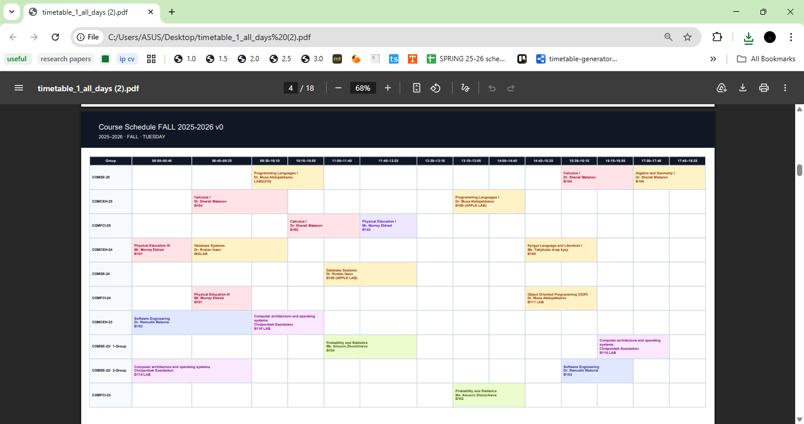
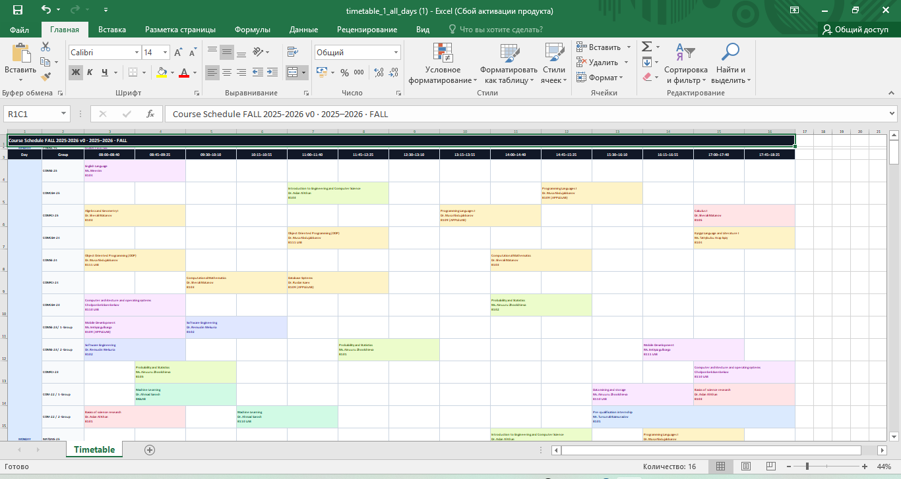

# Timetable Generator

Constraint-Based University Timetable Scheduling System.

This project helps university administrators create academic data, configure teaching assignments, generate class timetables, publish schedules, and export results to PDF or Excel.

## Overview

The system consists of two parts:

- Backend REST API for authentication, academic data management, timetable generation, and scheduling logic.
- Frontend web application for administrators to manage data and work with generated timetables.

## Main Features

- Login with JWT authentication
- Role-based access control
- Admin and Super Admin roles
- Dashboard with system overview
- Academic structure management:
    - Faculties
    - Departments
    - Majors
    - Groups
- Resource management:
    - Teachers
    - Subjects
    - Rooms
    - Time slots
    - Lunch breaks
- Timetable creation
- Assignment management
- Constraint-based timetable generation
- Manual placement for lessons that cannot be generated automatically
- Published timetable view
- Export timetable to PDF and Excel
- Responsive sidebar and topbar layout

## Tech Stack

### Frontend

- Next.js
- React
- TypeScript
- Tailwind CSS
- Axios
- jsPDF
- jspdf-autotable
- xlsx / xlsx-js-style

### Backend

- Java
- Spring Boot
- Spring Security
- JWT
- Spring Data JPA
- Maven
- REST API

## Project Structure

```txt
timetable-generator/
├── timetable-generator-backend/
│   ├── src/main/java/
│   │   └── com/example/timetablegenerator/
│   │       ├── config/
│   │       ├── controllers/
│   │       ├── domain/
│   │       ├── exceptions/
│   │       ├── generation/
│   │       ├── mappers/
│   │       ├── repositories/
│   │       ├── services/
│   │       └── utils/
│   ├── src/main/resources/
│   └── pom.xml
│
└── timetable-generator-frontend/
    ├── src/app/
    │   ├── login/
    │   ├── home/
    │   ├── faculties/
    │   ├── departments/
    │   ├── majors/
    │   ├── groups/
    │   ├── teachers/
    │   ├── subjects/
    │   ├── rooms/
    │   ├── users/
    │   ├── lessons/
    │   └── timetables/
    ├── src/components/
    ├── src/lib/
    └── package.json
```

## Screenshots

### Login



### Dashboard



### Majors Management



### Users Management



### Timetables List



### Timetable Grid



### Assignment Form



### Export Result


